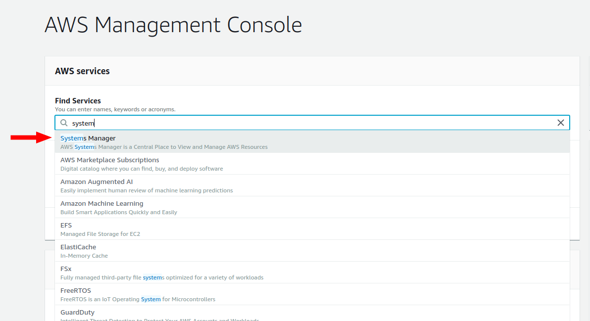
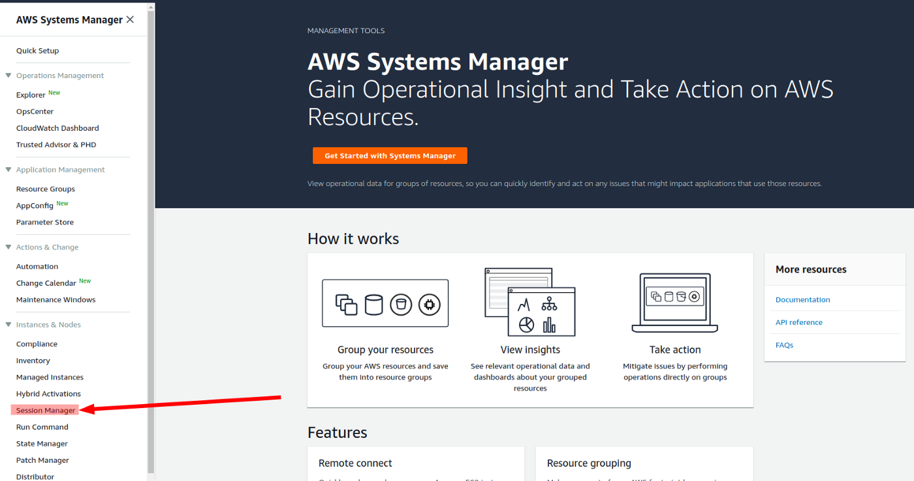
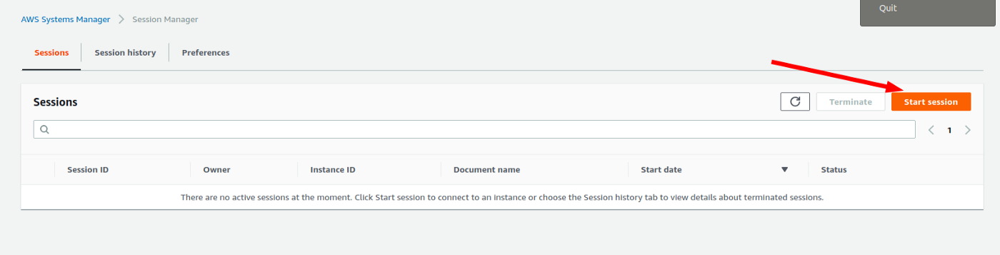
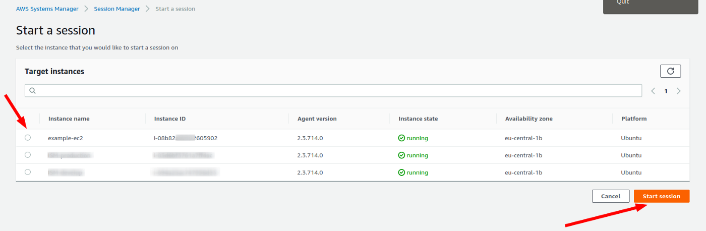

# tf-e2-ssm-ec2-default-vpc
Learn Terraform Exercise with EC2 Instance in default VPC with SSM

```
terraform fmt
terraform validate
terraform plan -out my-tf-plan.tfplan
terraform apply my-tf-plan.tfplan
```

## Systems Manager

Now test access with Systems Manager and this console:






### Access Instance via aws cli, similar to ssh

Access the instance without Security Group configuration or punch holes

```bash
# find the instance ID based on Tag Name
INSTANCE_ID=$(aws ec2 describe-instances \
               --region eu-west-1 \
               --filter "Name=tag:Name,Values=ExampleAppServerInstance" \
               --query "Reservations[].Instances[?State.Name == 'running'].InstanceId[]" \
               --output text)
# create the port forwarding tunnel
aws ssm start-session  --region eu-west-1 \
                       --target $INSTANCE_ID
```
### Use-Case: Use Port Forwarding to / from an instance

Enter the Session console via AWS Console and start a python webserver on port 8000 for testing

```
bash
cd
curl -L https://lastweekinaws.com/blog > index.html
python3 -m http.server 8000
```

#### port forwarding using aws systems manager session manager

Port forwarding using Systems Manager Session insted of ssh -L, see also

https://aws.amazon.com/blogs/aws/new-port-forwarding-using-aws-system-manager-sessions-manager/

Prereq: Install the Session Manager plugin for the AWS CLI, see also

https://docs.aws.amazon.com/systems-manager/latest/userguide/session-manager-working-with-install-plugin.html

```bash
brew install --cask session-manager-plugin
```
or

```bash
curl "https://s3.amazonaws.com/session-manager-downloads/plugin/latest/mac/sessionmanager-bundle.zip" -o "sessionmanager-bundle.zip"
unzip sessionmanager-bundle.zip
sudo ./sessionmanager-bundle/install -i /usr/local/sessionmanagerplugin -b /usr/local/bin/session-manager-plugin
```

```bash
# find the instance ID based on Tag Name
INSTANCE_ID=$(aws ec2 describe-instances \
               --region eu-west-1 \
               --filter "Name=tag:Name,Values=ExampleAppServerInstance" \
               --query "Reservations[].Instances[?State.Name == 'running'].InstanceId[]" \
               --output text)
# create the port forwarding tunnel
aws ssm start-session  --region eu-west-1 \
                       --target $INSTANCE_ID \
                       --document-name AWS-StartPortForwardingSession \
                       --parameters '{"portNumber":["8080"],"localPortNumber":["9999"]}'
```

### Improve the feeling in using bash

By default, sessions on EC2 instances for Linux start using the Bourne shell (sh). However, you might prefer to use another shell like bash. By allowing configurable shell profiles, you can customize preferences within sessions such as shell preferences, environment variables, working directories, and running multiple commands when a session is started.

see also: https://docs.aws.amazon.com/systems-manager/latest/userguide/session-preferences-shell-config.html

--> checkout git branch `enable_session-manager-settings`